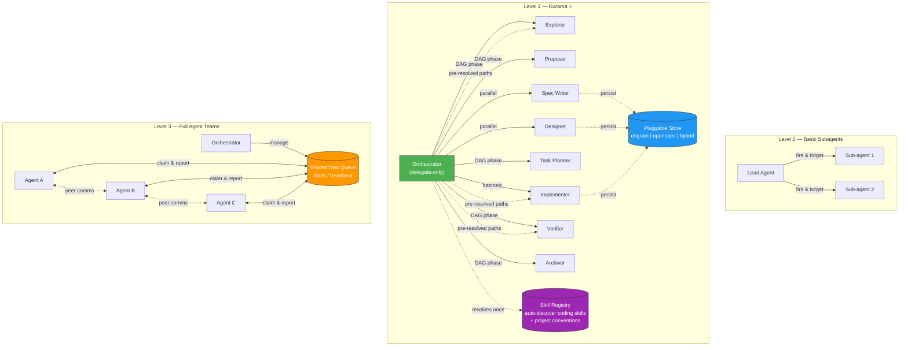

# Architecture

Deep dive into how Kurama is structured. For quick start, see the [main README](../README.md).

---

## Where Kurama Fits

Kurama sits between basic sub-agent patterns and full Agent Teams runtimes:


```mermaid
graph TB
    subgraph "Level 1 — Basic Subagents"
        L1_Lead["Lead Agent"]
        L1_Sub1["Sub-agent 1"]
        L1_Sub2["Sub-agent 2"]
        L1_Lead -->|"fire & forget"| L1_Sub1
        L1_Lead -->|"fire & forget"| L1_Sub2
    end

    subgraph "Level 2 — Kurama ⭐"
        L2_Orch["Orchestrator<br/>(delegate-only)"]
        L2_Explore["Explorer"]
        L2_Propose["Proposer"]
        L2_Spec["Spec Writer"]
        L2_Design["Designer"]
        L2_Tasks["Task Planner"]
        L2_Apply["Implementer"]
        L2_Verify["Verifier"]
        L2_Archive["Archiver"]

        L2_Orch -->|"DAG phase"| L2_Explore
        L2_Orch -->|"DAG phase"| L2_Propose
        L2_Orch -->|"parallel"| L2_Spec
        L2_Orch -->|"parallel"| L2_Design
        L2_Orch -->|"DAG phase"| L2_Tasks
        L2_Orch -->|"batched"| L2_Apply
        L2_Orch -->|"DAG phase"| L2_Verify
        L2_Orch -->|"DAG phase"| L2_Archive

        L2_Store[("Pluggable Store<br/>engram | openspec | hybrid")]
        L2_Registry[("Skill Registry<br/>auto-discover coding skills<br/>+ project conventions")]
        L2_Spec -.->|"persist"| L2_Store
        L2_Design -.->|"persist"| L2_Store
        L2_Apply -.->|"persist"| L2_Store
        L2_Orch -.->|"resolves once"| L2_Registry
        L2_Orch -.->|"pre-resolved paths"| L2_Explore
        L2_Orch -.->|"pre-resolved paths"| L2_Apply
        L2_Orch -.->|"pre-resolved paths"| L2_Verify
    end

    subgraph "Level 3 — Full Agent Teams"
        L3_Orch["Orchestrator"]
        L3_A1["Agent A"]
        L3_A2["Agent B"]
        L3_A3["Agent C"]
        L3_Queue[("Shared Task Queue<br/>claim / heartbeat")]

        L3_Orch -->|"manage"| L3_Queue
        L3_A1 <-->|"claim & report"| L3_Queue
        L3_A2 <-->|"claim & report"| L3_Queue
        L3_A3 <-->|"claim & report"| L3_Queue
        L3_A1 <-.->|"peer comms"| L3_A2
        L3_A2 <-.->|"peer comms"| L3_A3
    end

    style L2_Orch fill:#4CAF50,color:#fff,stroke:#333
    style L2_Store fill:#2196F3,color:#fff,stroke:#333
    style L2_Registry fill:#9C27B0,color:#fff,stroke:#333
    style L3_Queue fill:#FF9800,color:#fff,stroke:#333
```

---

## Capability Comparison

| Capability | Basic Subagents | Kurama | Full Agent Teams |
|---|:---:|:---:|:---:|
| Delegate-only lead | — | ✅ | ✅ |
| DAG-based phase orchestration | — | ✅ | ✅ |
| Parallel phases (spec ∥ design) | — | ✅ | ✅ |
| Structured result envelope | — | ✅ | ✅ |
| Pluggable artifact store | — | ✅ | ✅ |
| **Skill auto-discovery** | — | ✅ | ✅ |
| Shared task queue with claim/heartbeat | — | — | ✅ |
| Teammate ↔ teammate communication | — | — | ✅ |
| Dynamic work stealing | — | — | ✅ |

---

## System Architecture

```
┌──────────────────────────────────────────────────────────┐
│  ORCHESTRATOR (coordinator — never does real work)         │
│                                                           │
│  Responsibilities:                                        │
│  • Delegate ALL tasks to sub-agents (not just SDD)        │
│  • Launch sub-agents via Task tool                        │
│  • Show summaries to user                                 │
│  • Ask for approval between phases                        │
│  • Track state: which artifacts exist, what's next        │
│  • Suggest SDD for substantial features/refactors         │
│                                                           │
│  Context usage: MINIMAL (only state + summaries)          │
└──────────────┬───────────────────────────────────────────┘
               │
               │ Task(subagent_type: 'general', prompt: 'Read skill...')
               │
    ┌──────────┴──────────────────────────────────────────┐
    │                                                      │
    ▼          ▼          ▼         ▼         ▼           ▼
┌────────┐┌────────┐┌────────┐┌────────┐┌────────┐┌────────┐
│EXPLORE ││PROPOSE ││  SPEC  ││ DESIGN ││ TASKS  ││ APPLY  │ ...
│        ││        ││        ││        ││        ││        │
│ Fresh  ││ Fresh  ││ Fresh  ││ Fresh  ││ Fresh  ││ Fresh  │
│context ││context ││context ││context ││context ││context │
└───┬────┘└───┬────┘└───┬────┘└───┬────┘└───┬────┘└───┬────┘
    │         │         │         │         │         │
    └─────────┴─────────┴────┬────┴─────────┴─────────┘
                             │
               (receive pre-resolved compact rules
                from the orchestrator's launch prompt)
                             │
                 ┌───────────▼───────────┐      ┌────────────────────┐
                 │    SUB-AGENT USES     │      │   SKILL REGISTRY   │
                 │   skills as directed  │      │                    │
                 │ • React, TDD, etc.   │      │ • Your coding      │
                 │ • Project conventions │      │   skills + paths   │
                 └───────────────────────┘      │ • Project conven- │
                                                │   tions (agents.md)│
                           ORCHESTRATOR ────────▶ resolves once/session
                                                └────────────────────┘
```

---

## The Dependency Graph

The canonical phase DAG — `explore → propose → (spec ∥ design) → tasks → apply
→ verify → archive` — is declared once in
[`skills/_shared/sdd-phase-common.md`](../skills/_shared/sdd-phase-common.md).
See it there instead of duplicating the graph here; the "Where Kurama
Fits" diagram above renders the same flow visually.

---

## Sub-Agent Result Contract

Every sub-agent returns a structured envelope (`status`, `executive_summary`, `detailed_report`, `artifacts`, `next_recommended`, `risks`, `skill_resolution`) to the orchestrator. The canonical field list, description, and example live in [`skills/_shared/sdd-phase-common.md`](../skills/_shared/sdd-phase-common.md), Section D — see it there instead of duplicating it here.

---

## Project Structure

```
kurama/
├── README.md                          ← Project overview and quick start
├── LICENSE
├── VERSION                            ← Version source of truth; installers and skills/manifest.json reference it
├── .claude-plugin/                    ← Claude Code plugin packaging (alternative to manual copy)
│   ├── plugin.json                    ← name/version (from VERSION)/description/skills path
│   └── marketplace.json               ← Single-entry marketplace example for `/plugin marketplace add`
├── skills/                            ← 29 skill files (28 installed by default) + shared conventions
│   ├── manifest.json                  ← Declares every skill (group: sdd-core | quality | review | optional | tdd | lang) + per-harness install targets; installers read this instead of a hardcoded list. `lang` is OFF by default — a default install carries no language-specific knowledge
│   ├── _shared/                       ← Shared conventions (referenced by all skills) + shipped helper scripts
│   │   └── build-skill-registry.sh   ← Writes .kurama/skill-registry.md (index only, no model in the loop)
│   │   ├── sdd-phase-common.md        ← Most load-bearing shared file: the canonical DAG, change-size path, Phase I/O table, and Sections A-D (skill loading, retrieval, persistence, envelope), loaded by all 8 SDD phase skills
│   │   ├── orchestrator-sdd-protocol.md ← Orchestrator session protocol loaded on demand when a cycle starts: SDD Session Preflight, Entry Routing, Automatic Mode Gatekeeper. Extracted from the orchestrator prompt so a non-SDD session never pays for it
│   │   ├── review-ledger-contract.md  ← Lens selection triage (the orchestrator's decision procedure) + the shared blocking/ledger rules every review lens obeys
│   │   ├── persistence-contract.md    ← Mode resolution, sub-agent context protocol, skill loading
│   │   ├── engram-convention.md       ← Supplementary: deterministic naming & recovery
│   │   ├── openspec-convention.md     ← File paths, directory structure, config reference — Kurama's own convention, NOT the upstream OpenSpec CLI format
│   │   ├── skill-resolver.md          ← Canonical orchestrator protocol for compact-rule injection
│   │   └── test-runners.md            ← Project commands (test / single-test / build), CONFIGURED at sdd-init rather than detected, plus a suggestion table of common-ecosystem defaults that carries no authority
│   ├── sdd-init/SKILL.md             ← Bootstraps project + builds skill registry
│   ├── sdd-new/SKILL.md              ← Meta-skill: starts a new SDD change (exploration + proposal)
│   ├── sdd-continue/SKILL.md         ← Meta-skill: resumes a change from persisted state
│   ├── sdd-ff/SKILL.md               ← Meta-skill: fast-forwards remaining phases with auto-continue
│   ├── sdd-explore/SKILL.md
│   ├── sdd-propose/SKILL.md
│   ├── sdd-spec/SKILL.md
│   ├── sdd-design/SKILL.md
│   ├── sdd-tasks/SKILL.md
│   ├── sdd-apply/SKILL.md            ← v2.0: TDD workflow support
│   ├── sdd-verify/SKILL.md           ← v2.0: Real test execution + spec compliance matrix
│   ├── sdd-archive/SKILL.md
│   ├── skill-registry/SKILL.md       ← Runs _shared/build-skill-registry.sh (writes .kurama/skill-registry.md)
│   ├── judgment-day/SKILL.md         ← Dual blind review + fix loop
│   ├── go-testing/SKILL.md           ← Go test patterns (`lang` group, OFF by default — opt in with `install.sh --with lang`)
│   ├── skill-creator/SKILL.md        ← Creates new skills from templates
│   ├── tdd/SKILL.md                  ← RED-GREEN-REFACTOR module (`tdd` group, installed by default; activation stays opt-in per project — opt out with `install.sh --without tdd`)
│   ├── issue-creation/SKILL.md       ← GitHub issue creation workflow
│   └── branch-pr/SKILL.md            ← Branch + pull request workflow
├── docs/                              ← Deep-dive documentation
│   ├── architecture.md               ← This file: system design and structure
│   ├── changelog.md                  ← Release history
│   ├── concepts.md                   ← Delta specs, RFC 2119 keywords, archive cycle
│   ├── installation.md               ← Per-tool setup (automated + manual + plugin/extension)
│   ├── migration.md                  ← Breaking-change and upgrade guide (current + previous series)
│   ├── persistence.md                ← Artifact store modes and OpenSpec file structure
│   ├── sub-agents.md                 ← SDD phase sub-agent reference, native subagents, and agent-teams mode
│   ├── tdd.md                        ← Optional TDD module: activation, cycle, verify audits
│   ├── hooks.md                      ← Optional Claude Code hooks: prose-to-mechanism quality gates
│   └── token-economics.md            ← Token cost analysis and delegation savings
├── examples/                          ← Config examples per tool — generated from _templates/, see below
│   ├── _templates/                    ← SSOT: core.md (shared orchestrator body) + one {harness}.md overlay per harness; scripts/build-examples.sh assembles both into every file below
│   ├── claude-code/
│   │   ├── CLAUDE.md                  ← GENERATED — edit _templates/, then run scripts/build-examples.sh
│   │   ├── agents/                    ← Native subagents, one per SDD phase (model: opus for sdd-design/sdd-apply, sonnet for the rest)
│   │   └── hooks/                     ← PreToolUse write-guard + archive-gate hooks (hooks.json + scripts + README); installed automatically by `setup.sh --agent claude-code` (both scopes, since Phase 10b)
│   ├── opencode/
│   │   ├── AGENTS.md                  ← OpenCode orchestrator prompt referenced by config
│   │   ├── opencode.single.json       ← Orchestrator agent only; phases run as subtasks
│   │   ├── opencode.multi.json        ← Orchestrator + dedicated sdd-<phase> agents, model customizable per phase
│   │   └── commands/sdd-*.md          ← Slash commands for OpenCode
│   ├── codex/agents.md
│   └── omp/
│       ├── AGENTS.md                  ← GENERATED — omp orchestrator context (native provider, highest priority)
│       ├── RULES.md                   ← omp-only sticky rules: always-apply, re-attached near the current turn
│       └── agents/                    ← 17 omp task agents (thinkingLevel/glob/spawns:"" — NOT interchangeable with the Claude or Pi sets, which omp filters out)
└── scripts/
    ├── setup.sh                       ← Full setup: detect + install + configure
    ├── install.sh                     ← Thin back-compat wrapper; maps legacy flags onto setup.sh (writes no receipt of its own)
    ├── install_test.sh                ← Regression test suite for ALL of scripts/ — setup, install, uninstall, update, doctor, setup-tui, validate_skills and lib/receipt.sh, plus the two shipped hooks
    ├── uninstall.sh                   ← Removes exactly what an install manifest recorded
    └── build-examples.sh              ← Assembles examples/_templates/ into every examples/* orchestrator file (portable bash 3.2/BSD)

# Generated in target projects (not in this repo):
.kurama/
├── skill-registry.md                  ← Skill INDEX for sub-agents, built by skills/_shared/build-skill-registry.sh
└── sdd/{change-name}/                 ← Engram fallback store (unavailable-at-start or mid-cycle mem_save failure)
```
